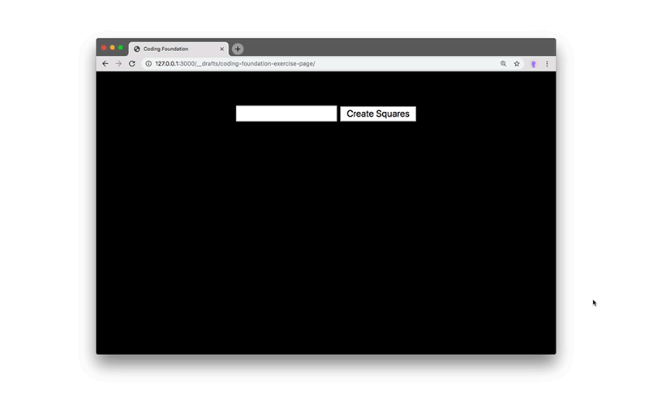

If things are unclear, please contact me on Slack or e-mail me at [leon.eckert@nyu.edu](mailto:leon.eckert@nyu.edu).

Setup

- [Github](#github)
    - Make a GitHub account
    - Create your own repository for this semester ("fork" one I prepared for you)
    - Bring a website live on the web (using "Github Pages")
- [Software](#software)
    - Google Chrome
    - GitHub Desktop
    - VS Code
- [Working Environment](#working-environment--working-on-projects)
    - Clone your remote repository using VS Code
    - Working on Projects
        - Open you files in VS Code
        - [Using Live Server](#using-live-server)
        - [Push changes to your remote GitHub repository](#pushing-changes-to-your-remote-github-repository)
- [Coding Exercise](#coding-exercise)
    - [exercise](#coding-exercise)
    - [submit your work](#push-it-all-to-your-github)


# **Setup**

All the work we do this semester is in the form of **websites**. We build a lot of websites, most of them containing data visualizations.

## GitHub

This semester you will be maintaining your own Github **repository** to backup and share your work. You will have one folder in which all the work regarding this class will take place. Your **repository** ("repo") then can be thought of as an online backup copy of that local ("on your computer") project folder. 

Our Resources:

1. The **Class Website** where almost everything you need to know is shared (schedule, assignments, ...). In our case this is NYU's Brightspace. 
2. The **Class code repository**. My page on GitHub. I will share code there that we work on in class. And you will submit links to your own assignment work through this repository. More on that later!
3. **Your own repository**. Your page on GitHub. You will be the only person uploading files to it: all the work you produce in this class. Instead of "uploading", we will call this action "push" from now on. You make changes to your files on your computer ("local"), then push them to your "remote repository". You see, I am sliding in some terminology here that you will need to get used to.

You will need to organize your files with a lot of care this semester, but it will pay off in exciting new learnings 👻

In the following steps, I will guide you through the setup of all this

### 1) Make a GitHub account.

If you already have a GitHub account (and remember your login), you can use that. If not, it's is much like setting up any other account on the web: https://education.github.com/pack.

### 2) **Create your own repository.**

You can create as many repositories as you like. They are public by default, everyone can see them. It's great to share code, we should all get used to this. However, you should keep this in mind so you don't accidentally share sensitive information. Don't worry though, I will remind you often and show you ways to avoid it :)

You will find a big PLUS symbol (don't click it just yet 🚨 ) on the top menu bar when you are logged into GitHub. This is where you create new repositories. Hold on though, don't click it 🤣 because you will create the repository for this class differently. Why? Because I have prepared some files for you.

You will "fork" (make a copy) of a repository I have prepared. Open this link in a new tab: https://github.com/leoneckert/sdv-student. Click on "fork" in the top right corner:


After some seconds you will be redirected to a page that looks almost the same, but, if you look closely, you will notice that you now have your own copy of the repository that I prepared for you. You can also find it under your repositories on your profile:


### 3) Turn your repository into a "GitHub Page"

Now it will get exciting already. Websites are **code files** that are **on the web (on a server)** and can be requested/visited through the browser. GitHub is an **online** repository for your **code files**. On GitHub, we can visit and see the code you wrote ~~~~> but if these files are already online (on GitHub), we should be able to visit them and see them rendered as a real website, too. For this, GitHub created GitHub Pages - you can find instructions and information about it [here](https://pages.github.com/), but I'll also run you through the setup (spoiler: it's just a few clicks!).

Start by finding the settings of your repo. With the repo open, click right here:


In Settings, find “Pages” in the left sidebar. Select the "main" branch (if you are curious what a branch is, ask me after class 🙂 ), then click "Save":


The page should refresh, or you can refresh the page yourself as well. Sometimes this may also take a little while, but ultimately you should find your link right there. 


Copy that link and make note of it somewhere. Also, open it in a new tab for now.

I want to pause here for a second and explain what is happening. Your repo is an online space where you will upload, backup, share your files, mainly coding files, and in our case, specifically web-coding files (written to be rendered as webpages). All those files can be accessed through the normal GitHub interface where we see the actual code -- try to click through your repo, there is some html code in the `projects/test-page/index.html` folder:


The same files can also be accessed directly (not inside the GitHub interface); when doing this, the browser will try to render them as websites if it's possible (e.g. html files will always be rendered). That's wat GitHub Pages is for. The link you opened in the other tab, is looking at your repo and tries to render the files...

...check it out! Hopefully you will see a page displaying the repository's main `README.md` file: "Storytelling with Data Visualization 🦕 ..." (most browsers render `.md` "markdown" in much the same way as html files).

Quiz: How could you make the browser render the `index.html` file that is inside the `projects/test-page/` folder? Try to find a solution yourself before you scroll on.


The link to your GitHub Page (the one you copied before) that looks something like your-username.github.io/sdv-stud... points to the "root" of your repo the most basic folder inside it. From there, you can navigate through all files and folders by modifying the url. If you append `/projects/test-page/index.html` to the url, the browser will render that file/webpage. Try it! FYI, you can omit writing "index.html" here, as your browser looks by files with this name by default. Things should look like this:


Great. We are done with GitHub for now. Later we learn how we can modify files on our computer and then push them to the GitHub repository and hence truly do with the page(s) "what we want". 👻


## **Software**

Software you need for this class.

### **Google Chrome**

This is the browser we will be using. Please [download it](https://www.google.com/chrome/) if you don't have it already. I'd also recommend to make it your computer's default browser.


### **GitHub Desktop**

We will be writing code *locally* on our computer, and then push our change speriodically to our *remote* GitHub repository online. I will be using the **GitHub Desktop** application to do that. You can download it [here](https://desktop.github.com/), open it and log into your GitHub account. Hopefully that works!

#### CLone your repository

We only need to do this once. Because your course foler already exists online (the repository you forked), we need to download it ("clone" int) to our local computer. In GitHub Dekstop, select "Clone Repository..."


Next you should be able to search for "sdv-student". (1) Select it, and don't forget to (2) choose a location on your computer where your repository should be downlaoded, too. Reminder: this is the main folder you will be using the entire semester, pick a good location for it!


GitHub Desktop should reflect whether the clone suceeded. Perhaps it will show you the repository in the side bar, like for me: 


We get back to the downloaded repo later. 

### **Text Editor**

**If you have a Text Editor you feel comfortable with, feel free to use it.** The only thing I require is that you have a way to work with a local server. I will be using the **Visual Code Studio (”VS Code”)** Text Editor this semester and invite you to do the same. You can download it [here](https://code.visualstudio.com/Download).

## VS Code Extensions

Using our Code Editor, we want to do two things: 

1. Create files, organize files and **write code**. (that is the application’s basic function)
2. Create a “**Live Server**” allowing us to view the website we are building, as we are making changes to it in the browser. (Install the “Live Server” extension, explained below)

In the side bar select the Extension icon (four blocks) and search for the “Live Code” extension. Click “Install”. Done ✅ (more about it soon).


FYI: By default, VS Code appears in a dark color theme. You can modify themes in the preferences (click the gear ⚙️ in the bottom left and select “Color Theme”).


### **Working Environment** / Working on Projects

**Open your files in VS Code (the right way(s))**

Reopen VS Code, it should be empty. If it's not, close the tabs you see. Opening files in VS Code is easy, but it can often lead to confusions in your file structure if you don't follow the right steps. In my experience, opening single files in VS Code is never a good idea; instead I recommend **opening whole project folders** where we can see files and their context. In VS Code select `File>Open Folder` and navigate to the lcation of the folder in your file system. After opening it, you should see the same files you saw online on Github:


#### **Using Live Server**

From now on you will always use the Live Server extension we installed before. Activate it by clicking “Go Live” in the bottom right corner of VS Code.


Your default browser (make it be Chrome, please) should automatically open, in the url you will see something like http://127.0.0.1:5500/ or http://localhost:5500/ (the number at the end might vary) and in the browser you see all the folders and files from your "sdv-student" directory:


great! this is exciting :D you will be able to see everything you work on here. Mainly you will work on websites in this class, if you work on them while using “Live Server”, you can see changes you make in real time. In your browser click on projects and the test-page folder, the same website we saw on our GitHub Pages before!

Let's quickly hold here to reflect one what we already learned today: We build websites. Website are text-based code and the browser know how to interpret and render this text. **Locally** (on our computer) we can **see and edit the text/code in VS Code** while seeing the **rendered page in the browser using Live Server**. Equally, **online** ("remote") we can **see the text/code within the GitHub** interface and the **rendered version of the page on the GitHub Page** link we created earlier.

where | see code | see page
---|---|---
local (your computer) | VS Code | Browser (via "Live Server")
remote (on the web) | GitHub.com | Browser (via Github Pages link)

If you make changes (in VS Code) to your file (the `index.html` in the placeholder page for example), you will see them immediately reflected in the browser. This is not “online”; it’s in the browser but only visible locally to you. That's how you work on your projects. When the work is done, you push the changes you made from you local repository (the whole class folder) to you remote one on GitHub....and then the online version, both GitHub and GitHub Page, will reflect your changes, too. That's what we will learn next.

Right after quickly...

**Shutting Down Live Server**

to shut down Live Server, simply click onto the “Port...” text you see in the same place you saw “Go Live” earlier:


### **Pushing changes to your remote GitHub repository**

Okay, I bet this is new for you and I am excited. Let's assume we work on a project somewhere inside the "sdv-student" directory. Normally this would probably take place in a place like `sdv-student/projects/fantastic-project`; but for now, let's make some changes in `projects/test-project/index.html` and save them (cmd+s).

I edited index.html:


Now, let's head to the **GitHub Desktop** application. 


Yours should look simmilar to mine. You might see your changes in the main panel and see the files that you have changed in the left, right? This mean that GitHub Desktop is *keeping track of all the changes we make to any files in this folder/repo*

(I want to mention here that apart from GitHub (online) there is something called "git" that exists locally. I might distinguish the two in more detail in class or when you ask me)

Next, we want to **push** these changes. In other words, we want to upload out most recent work to GitHub. 

Whenever we do this, we have to do 3 things in GitHub Desktop. 
1. Write a short note about our changes
2. Commit our changes


3. Push to to our remote/online repo


Done! In GitHub Desktop, there shouldn’t be any changes visible anymore because you have **committed** and **pushed** them to GitHub! 

🎉

Quick, check your online GitHub interface and see if the changes show up there, too. Then check your rendered GitHub Page and see if the changes render accordingly online.

**How often to push changes?**

You save (ordinary cmd+s save in VS Code) your changes ALL THE TIME because that way you see them in your browser via Live Server. **However, you only commit and push changed “every now and then”, not so often.** Certainly when you want to show your work online (e.g. to submit homework) and perhaps after adding considerable work to your project as a way to save a milestone, e.g. after adding a specific feature to a visualization that was very hard to figure out. 

Well, that's it, you made it. You can now use GitHub (and VS Code and Live Server). This is very cool!!!

## **Coding Exercise**

**Chrome Developer Tools**

The Chrome Browser gives us tool that are **indispensable** when developing websites. If you understand just two features (the "Elements" tab and the "JavaScript Console") and make use of them while coding, you will build great websites very quick. Please make yourself familiar by reading the [Introduction](https://www.bitdegree.org/learn/chrome-developer-tools) as well as the chapters about [Elements](https://www.bitdegree.org/learn/inspect-element) and the [JavaScript Console](https://www.bitdegree.org/learn/javascript-console).

### **File Structure**

It will make your life easier if you organize your files well. Here is the structure I recommend for you `sdv-student` directory:

```
sdv-student
├── projects
│   ├── test-page
│   │   ├── index.html
│   │   ├──  style.css
│   │   └── README.md
│   ├── README.md
│   └── ...
│
├── coding-exercises
│   ├── website
│   ├── coding-foundation  <-- create this folder for the following exercise
│   │   ├── index.html
│   │   ├── style.css
│   │   ├── script.js
│   │   └── ...
│   └── ...
├── README.md
└── ...
```

Please start to bring such a structure into place. You can create folders and files within Atom's sidebar.

### **Build a website**

Finally, making use of the **Live Server** and **Chrome Developer Tools** you learnt above, **build a website** in `sdv-student/coding-exercises/coding-foundation`. There are much fewer instructions than above because I want you to figure out (recall from last Semester / the internet) much on your own. Your website should have **separate html, css, js files** and behave like this one (but does not need to/should not look exactly the same, be creative!):



Please build a website like this in pure ("vanilla") JavaScript (no libraries! no p5! no jquery!). Feel free to add you own styling or variations. But keep the functionality: an input element that controls the number of elements (in my case white boxes) on the page. Give your best and ask the Internet all of your questions, it can help!

### **keyword hints**

`getElementById`, `createElement`, `appendChild`, `flexbox`, `for-loop`, `addEventListener`, `function`

### **"it doesn't work!" trick**

if things don't behave the way you want/expect them to, please check if there are error messages in the Chrome JavaScript Console (learnt above) - the console should be open by default while you are working. The error message in itself might give you a hint, and if it doesn't, copy-paste the whole error message into Google - someone else likely encountered similar difficulties and found solutions.

### **After you are done**

### **Add a README.md file**

Your work will look great on GitHub if you add README.md files to folders. GitHub renders them as the "front page" of a folder - just like [here](https://github.com/leoneckert/sdv-student), for example. The ".md" stands for "Markdown" which is a specific syntax for writing text. Since this might be your first time doing this, simply add the README.md file here:

```
sdv-student
├── coding-exercises
│   ├── ...
│   │
│   ├── coding-foundation  
│   │   ├── ...
│   │   └── README.md <-- add this file.
│   └── ...
└── ...
```

...and write something into it. If you had difficulties with the assignment, please describe them there. If you want the README.md file look great on GitHub, please see this [Markdown Cheatsheet](https://guides.github.com/features/mastering-markdown/)) as well as the Markdown preview option in VS Code:


### **Push it all to your GitHub**

As learnt above...

### **Add a link to our class Wiki**

find the files you have just worked on on your GitHub account (do you see the README.md file rendered, too?). You should submit two links: The link to your actual code (in GitHub, looks something like "github.com/your-username/sdv-student/tree/main....") as well as the link to your rendered page (GitHub Pages that you set up before, the link looks something like "your-username.github.io/sdv-student/coding-exercises....")

Copy the links and paste them to our [Class Wiki](https://github.com/leoneckert/sdv-s24/wiki#sections).

## **DONE! 😃**

### **This was A LOT. Please be proud.**