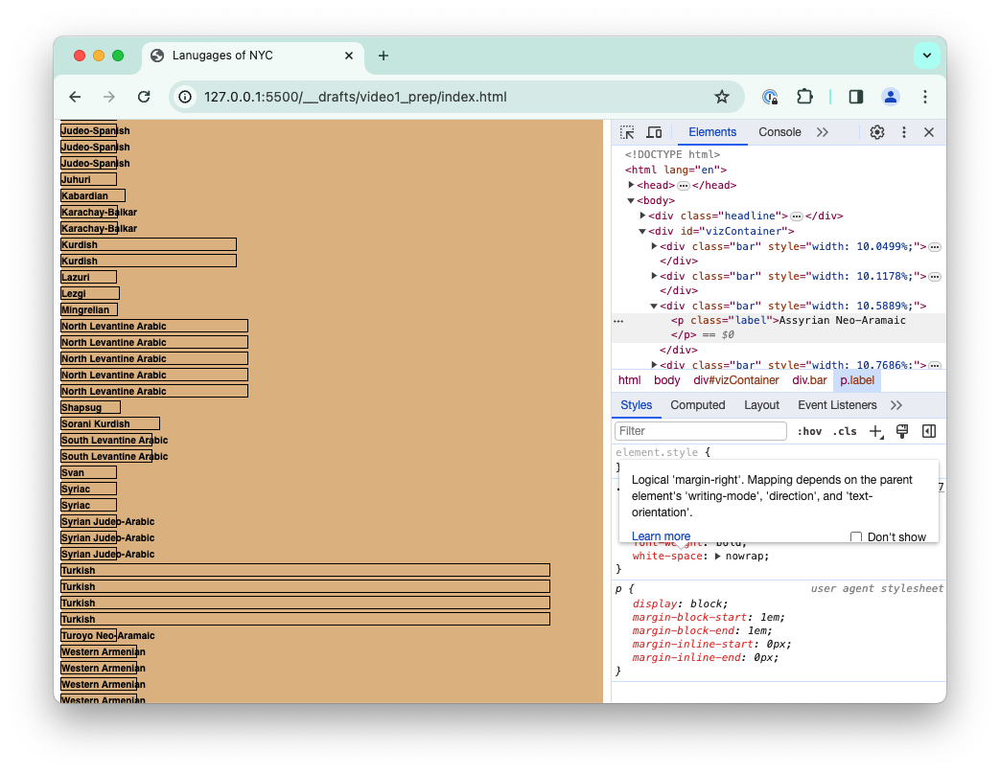

In the [first part](#part-1) of today’s lesson we will go over some shared understanding of how the browser sees the websites we built. In this part you can lean back and just follow my logic.
In the [second part](#part-2), we will code together and work with pure JavaScript, no D3.js library yet. I want to cover some basic techniques to work with data arrays, as well as creating a visual representation for a dataset in the browser. 


## Part 1


### DOM [SLIDES](https://docs.google.com/presentation/d/1MuyDcqSAwMVsQEX6U0h0CpsPNJ3QIf9rbXNKJPFInHo/edit#slide=id.g2b2a4cc9eae_0_462)

The DOM is a concept fundamental to web development and I would like to review it. 
Slide 1: The code on the left produces the website on the right, the browser renders our text-based code. 
Slide 2: AS coders we should always work with the Developer tools in the browser, the Console for all things JavaScript should be a familiar concept. The Elements tab is all about the elements that are rendered on the page. In this view you see that the Elements tab very much reflects the code we initially wrote. 
Slide 3: However, websites often change while we use them: interactions might trigger elements to move, disappear or for new elements to be created. In the Elements tab, we see those changes in real-time: it always reflects the elements that make up the website at any given moment. 
Slide 4: And that’s the DOM, it’s the data (text) representation of the objects we see on the website. 
Slide 5: Put differently, the DOM is a structure of nodes and objects that represent whatever appears on the page at a given time.
Slide 6: We need the DOM, the text-based representation, in order to “read” and “manipulate” the page using JavaScript. We access the DOM when using statements like “document.getElementByID(“headline”) for example. 
Slide 7: After the browser receives the HTML structure we have written, it parses the text to create such a DOM tree structure where all elements stand in relation to each other. 
Slide 8: The text in the elements tab is equivalent to that DOM tree, just line by line. 

### BROWSER SEES A WEBSITE [SAME SLIDES](https://docs.google.com/presentation/d/1MuyDcqSAwMVsQEX6U0h0CpsPNJ3QIf9rbXNKJPFInHo/edit#slide=id.g2b2a4cc9eae_0_462)


Slide 1: Next, let’s think through how a browser sees a website. Everything starts with just one file that the browser receives from a web server. Typically that’s the index.html file. 
Slide 2: The browser then reads this file line by line (remember, it’s building the DOM tree representation). When it comes across other files referenced, like images, or like here, the CSS file. It will immediately request that file from the server, too. 
Slide 3: Here the browser comes across the line referencing the JavaScript file, too. The browser now has three files that it scans to render our website. 
Slide 4: With only the HTML…
Slide 5: …the website would look like this.
Slide 6:
Slide 7: If we include the CSS file…
Slide 8: …as you might expect, the website now includes some styling. 
Slide 9: 
Slide 10: and with the JavaScript…
Slide 11+: …comes the interaction
Slide 13: We repeat that CSS styles, 
Slide 14: and JavaScript, if I summarize it, really does two things: it manipulates elements on the website, and it listens to our interactions with it. 
Slide 15: To manipulate elements with JavaScript, we first have to SELECT an element (or create one), and then we can do with it what we want. 
Slide 16: To listen, we first SELECT an element (or create one), then attach an eventlistener to that element and define what should happen if the event takes place. 
Slide 17: I want to stress what do these two processes have in common
Slide 18: both of them first select elements on the DOM. This seems minor, but it’s good to be aware of
Slide 19: The first thing in javascript (in interaction with the DOM, the website) is always to select an element. And that will certainly be the case for our work this semester where we heavily manipulate elements on the DOM to visualize data. From p5, you will not be familiar with that concept because p5 uses a single element in the DOM, the canvas, and works solely with the pixels on that canvas. D3 draws shapes with actual DOM elements, so called SVG elements. 

Today we will get a taste of working with DOM elements, even if we don’t yet make use of D3. 


## Part 2

Let’s code! 

I prepared a cheat sheet for your future self. It has the form of a note-taking form that you can fill out as you watch this video. When applying learnings in the future, you can remind yourself of the key learnings. It’s [here](https://drive.google.com/file/d/1F9a_rZYCu9ILBQQgiH-lxgeT1U7BeDMR/view?usp=sharing) and you can print it out or work on it on a tablet. 

First we can pick a dataset from the list I made of easy-to-use datasets. I downloaded them and brought them into a better structure for us to work with: JSON. The JSON filetype is the one that is most native to JavaScript and hence the easiest to work with. On [this page](https://github.com/leoneckert/sdv-s24/tree/main/simpleDatasets), I link to where I ordinally downloaded them from, you can download my version of them [here](https://github.com/leoneckert/sdv-s24/blob/main/simpleDatasets/datasets.zip). 


For today’s exercise let’s use the “Languages of New York City” dataset together.

Okay we start with a basic setup of html, css and js file. And we throw our data file into the same folder: 

```
sdv-student
├── coding-exercises
│   ├── week1-DOM-viz  
│   │   ├── index.html
│   │   ├── style.css
│   │   ├── script.js
│   │   ├── nyc-language-data.json 
│   │   └── README.md
│   └── …
└── … 
```

In the index.html I am creating a very basic structure, mainly so that we can see something on the page. I will make a headline and an empty div (#vizContainer) – later on, the plan will be to use JS to create elements in that div to represent our data. Using Live Server, I see the website I work on in the browser. I also add some styling to make things more visible while I work:


```html
<!-- index.html -->
<!DOCTYPE html>
<html lang="en">
<head>
    <meta charset="UTF-8">
    <meta name="viewport" content="width=device-width, initial-scale=1.0">
    <title>Lanugages of NYC</title>
    <link rel="stylesheet" href="style.css">
</head>
<body>
    
    <div class="headline">
        <h1>Language spoken in New York City</h1>
    </div>

    <div id="vizContainer"></div>

    <script src="script.js" type="module"></script>
</body>
</html>
```


```css
/* style.css */
.headline{
    background-color: aqua;
}

#vizContainer{
    width: 100%;
    height: 100px; /* just needed while no elements are inside this div */
    background-color: burlywood;
}
```


The part highlighted green above is needed for something that is still quite a bit new in the web world. It will [allow us to include our data](https://bobbyhadz.com/blog/javascript-import-json-file) from within our script.js file. Let’s do it:

```js
// script.js

import data from './nyc-language-data.json' assert {type: 'json'};
 
console.log(data);
```


It worked, we can access our data via the variable “data” (we could have called it anything else, too). As we see in the console, my data array includes 1270 datapoints, quite a lot. 

**NOTE: after writing this tutorial I cleaned the data, you will have less datapoints in your dataset.**

### Array Techniques

Because all data(sets) come in form of arrays, this is a good moment to cover some basic, extremely powerful array methods in JavaScript. 

#### array.forEach()

Very oftenWe want to do something with every element of an array. We could use a classical for-loop to do so: 

```js
import data from './nyc-language-data.json' assert {type: 'json'};
 
// console.log(data);

for(let i = 0; i < data.length; i++){
    let datapoint = data[i];
    console.log(datapoint.Country)
}
```


…but because the operation is so common, there is a designated array method, it looks like this:

```js
// omitting upper parts of the code for brevity

function doSomethingWithDatapoint(datapoint){
    console.log(datapoint.Country)
}

data.forEach(doSomethingWithDatapoint) // hey, .forEach(), I want to run this 
                                       // function for each datapoint
```

same result:


The outcome is the same, but what is happening here. The .forEach() method assume we (the coder) wants to do something with each datapoint in an array. All the method that needs to know from us is what should happen with each datapoint – which we can conveniently define in a function which then pass to the method. 

A shorter version of this looks like this:

```js
data.forEach(function(datapoint){
    console.log(datapoint.Country)
})
```
And a shorter version still which i will be using from here onwards:

```js
data.forEach(datapoint=>{
    console.log(datapoint.Country)
})
```
we also don’t HAVE to call the datapoint “datapoint”. This works, too:
```js
data.forEach(d=>{
    console.log(d.Country)
})
```

#### array.filer()

another method we use very often (I use it more oven than .forEach) works very similar to .forEach().
Imagine you have to loop over every element of an array and, based on the elements values, make a decision if you want to keep the element or not – in the process you create a new, smaller, area that only contains some of the initial array’s elements based on a certain Criteria. For this we can use the .filter() method. Let’s use it on our data to reduce it’s size. Pick a feature of your dataset (console.log(data) to see its entirety) and try to filter by it.


I will first try to filter anything out that is not “Western Asia”:

```js
// omitting upper parts of the code for brevity

function filterFunction(datapoint){
    if(datapoint.World_Region == "Western Asia"){
        return true;
    }else{
        return false;
    }
}

let filteredData = data.filter(filterFunction)

console.log(filteredData)
```


First let’s talk syntax: .filter() will produce a new, smaller array, therefore we need to store that new array in a new variable (highlighted red above). In the filter function we are describing our criteria – the condition by which we want to keep a data point (when the filter function returns true) or discard it (return false). 

AS you see in the console log, filtering out any language that doesn’t originate from “Western Asia” reduced the size of my dataset to 78 datapoints (less with cleaned dataset). Try out reducing yours by different criteria. 

A shorter form to write the filter function is this: 

```js
let filteredData = data.filter(datapoint=>{
    if(datapoint.World_Region == "Western Asia"){
        return true;
    }else{
        return false;
    }
})
```
And a shorter version still, which I will use:
```js
let filteredData = data.filter(datapoint=>{
    return datapoint.World_Region == "Western Asia" // this will either be true or 
                                                    // false already, no need for 
                                                    // the if-statement
})
```
or
```js
let filteredData = data.filter(d=>{
    return d.World_Region == "Western Asia"
})
```

Besides .forEach() and .filter(), we will also often use the .map() method. I will not cover it today however. 

**NOTE: a great moment to fill out your Cheatsheet!**

Let’s visualize some data!

This is how my code looks right now, I will do all my visualizations with “filteredData”

```js
import data from './nyc-language-data.json' assert {type: 'json'};
 
let filteredData = data.filter(datapoint=>{
    if(datapoint.World_Region == "Western Asia"){
        return true;
    }else{
        return false;
    }
})

console.log(filteredData);
```

We want to create elements (e.g. divs) for each datapoint. But first, lets try creating a DOM element with JS regardless of the data. First step: selecting the element that is already on the page which we want to add to! I use [querySelector](https://developer.mozilla.org/zh-TW/docs/Web/API/Document/querySelector) to do that. 

```js
// omitting upper parts of the code for brevity

let vizContainer = document.querySelector("#vizContainer");
```
Next, we create a new div, giv it a class (so we can easily style it) and append it to the vizContainer element:

```js
// omitting upper parts of the code for brevity

let vizContainer = document.querySelector("#vizContainer");

let newDiv = document.createElement("div");
newDiv.className = "bar";

vizContainer.appendChild(newDiv)
```


```css
/* style.css */

.bar{
    height:12px;
    width: 50px;
    outline: 1px black solid;
}
```


Now we can see it. Next we can create such a div for each (forEach()!!) of you data points:

```js
// omitting upper parts of the code for brevity

let vizContainer = document.querySelector("#vizContainer");

// let newDiv = document.createElement("div");
// newDiv.className = "bar";
// vizContainer.appendChild(newDiv)

filteredData.forEach(datapoint=>{
    let newDiv = document.createElement("div");
    newDiv.className = "bar";
    vizContainer.appendChild(newDiv)
})
```


Excellent! Take out the “height” for the #vizContainer in your style.css file. That way the div’s size will just adjust to all the elements it contains

```css
/* style.css */
#vizContainer{
    width: 100%;
    /* height: 100px; */
    background-color: burlywood;
}
```


Next we could take a numerical feature of our dataset to impact the size of the bars. In my case I will use the “Global_Speakers” feature to see what the most unique languages from Western Asia are that are spoken in NYC. 

To do this, I first want to find out the biggest of such values in the dataset, once I have that I can scale the bars between 0% and 100% of the window width. Let find the maximum:

```js
// omitting upper parts of the code for brevity

// find maxmimum value
let maxValue = 0; // initialize it with low value

filteredData.forEach(datapoint=>{
    if(datapoint.Global_Speakers > maxValue){  // whenever we find a higher value
        maxValue = datapoint.Global_Speakers;  // store that value in the variable
    }
})

console.log("max value is", maxValue); // console log it

// draw datapoints
filteredData.forEach(datapoint=>{
    let newDiv = document.createElement("div");
    newDiv.className = "bar";
    vizContainer.appendChild(newDiv)
})
```


and now, for each datapoint we can calculate it’s percentage of that maximum value. And then draw the bars with that percentage (100% being the highest filling the full width)

```js
// omitting upper parts of the code for brevity

// draw datapoints
filteredData.forEach(datapoint=>{
    let newDiv = document.createElement("div");
    newDiv.className = "bar";

    let widthPercentage = datapoint.Global_Speakers / maxValue; // 0 to 100        
    widthPercentage = widthPercentage * 100; // a range from 0 to 100
    newDiv.style.width = widthPercentage + "%"; // define the width of the newDiv

    vizContainer.appendChild(newDiv)
})
```


Great, we can adjust the scaling a bit to out wished. I want no bar to fully “0%” and the longest bar should be a little bit before the edge. I map them to scale between “10%” and “90%”:

```js
// omitting upper parts of the code for brevity

// draw datapoints
filteredData.forEach(datapoint=>{
    let newDiv = document.createElement("div");
    newDiv.className = "bar";

    let widthPercentage = datapoint.Global_Speakers / maxValue; // 0-1
    widthPercentage = 10 + widthPercentage * 80; // 10-90
    newDiv.style.width = widthPercentage + "%"; 

    vizContainer.appendChild(newDiv)
})
```


better. Next, we can add more elements, definitely the data points name! I will create a p element and give it a class of “label”, then i put that p tag into the div we made.


I peak at the data point to remind myself of the precise names of the features. 

```js
// omitting upper parts of the code for brevity

// draw datapoints
filteredData.forEach(datapoint=>{
    let newDiv = document.createElement("div");
    newDiv.className = "bar";

    let label = document.createElement("p");
    label.className = "label";
    label.innerText = datapoint.Language;
    newDiv.appendChild(label)

    let widthPercentage = datapoint.Global_Speakers / maxValue; // 0-1
    widthPercentage = 10 + widthPercentage * 80; // 10-90
    newDiv.style.width = widthPercentage + "%"; 

    vizContainer.appendChild(newDiv)
})
```


***NOTE: when i wrote this tutorial, this dataset was structured slightly different causing the duplicate language names that you see in my screenshot, when yo do this, you should not have them.***

Good news: it worked. Bad news: it looks bad. The text needs to be smaller, and i need to prevent it from breaking the words in the small boxes. This is all things I need to google, too, so let’s explore together, CSS involves trying! Here is the solution I found:

```css
/* style.css */
// omitting upper parts of the code for brevity

.bar{
    height:12px;
    outline: 1px black solid;
    margin-bottom: 5px;
}

.label{
    margin:0;
    font-size: 10px;
    font-family: sans-serif;
    font-weight: bold;
    white-space: nowrap; /* prevents the word break */
}
```



this looks better, but I noticed something that can teach us about daatsets we find on the internet. Some languages don’t have a Global_Speakers count. AS a data designer we must decide what we do… Do we keep the record and have it represented as “almost no one speaks it” or do we erase the record for the sake of the accuracy of the remaining data? A really hard choice, noth options are wrong. 


I decided I will filter out the records that don’t have a Global_Speaker count. Now we have two filter functions:

```js
import data from './nyc-language-data.json' assert {type: 'json'};
 
let filteredData = data.filter(datapoint=>{
    if(datapoint.World_Region == "Western Asia"){
        return true;
    }else{
        return false;
    }
})

console.log(filteredData);

filteredData = filteredData.filter(datapoint=>{
    return datapoint.Global_Speakers != ""
})

console.log(filteredData);

// omitting lower parts of the code for brevity
```


That reduced my data to just 31 points! That’s all for today, feel free to add better styling, or information. For example:


or we could change out initial filter away from “Western Asia”. Here is “Northern Africa”


or leaving the filter away entirely:

```js
import data from './nyc-language-data.json' assert {type: 'json'};
 
// let filteredData = data.filter(datapoint=>{
//     if(datapoint.World_Region == "Northern Africa"){
//         return true;
//     }else{
//         return false;
//     }
// })

// console.log(filteredData);

let filteredData = data.filter(datapoint=>{
    return datapoint.Global_Speakers != ""
})

console.log(filteredData);

// omitting lower parts of the code for brevity
```

