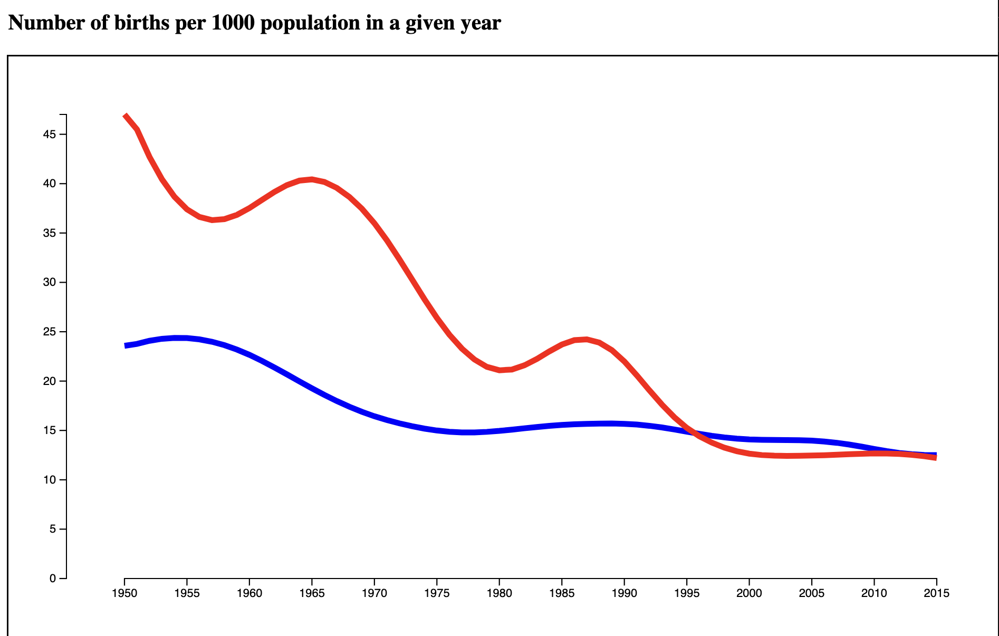

## Generators, Components & Layouts

- Review "Data Keys":
  - Example **Without** Keys
    - [online example](https://leoneckert.github.io/critical-data-and-visualization-spring-2022/labs/lab8/mini-transition-example-no-keys/)
    - [code](mini-transition-example-no-keys) & [download](mini-transition-example-no-keys/mini-transition-example-no-keys.zip)
  - Example **With** Keys
    - [online example](https://leoneckert.github.io/critical-data-and-visualization-spring-2022/labs/lab8/mini-transition-example-keys/)
    - [code](mini-transition-example-keys) & [download](mini-transition-example-keys/mini-transition-example-keys.zip)
  - Mike Bostock's [description](https://bost.ocks.org/mike/constancy/)
- Descriptions: Generators, Components & Layouts
- Coding a LINE Graph
  - Restructuring Data (very USEFUL!)
  - lineMaker function
- Exercise: line transition

### Descriptions: Generators, Components & Layouts
The following descriptions are taken from [*D3.js in Action, Second Edition*](https://livebook.manning.com/book/d3js-in-action-second-edition/about-this-book/) by Elijah Meeks.

> Generators
>
> D3 generators consist of functions that take data and **return the necessary SVG drawing code** to create a graphical object based on that data. For instance, if you have an array of points and you want to draw a line from one point to another, [...] a few D3 functions can help you with this process. These generators simplify the process of creating a complex SVG<path> by abstracting the process needed to write a <path>d attribute.

examples:
- [d3.line](https://github.com/d3/d3-shape/blob/v1.3.5/README.md#line)
- [d3.area](https://github.com/d3/d3-shape/blob/v1.3.5/README.md#area)
- [d3.arc](https://github.com/d3/d3-shape/blob/v1.3.5/README.md#arc) (used to create the pie pieces of pie charts)
- [d3.pie](https://github.com/d3/d3-shape/blob/v1.3.5/README.md#pie)


> Components
>
> In contrast with generators, which produce the d attribute string necessary for a <path> element, components **create an entire set of graphical objects** necessary for a particular chart component. The most commonly used D3 component [...] is d3.axis, which creates a bunch of `<line>`, `<path>`, `<g>`, and `<text>` elements that are needed for an axis based on the scale and settings you provide the function.

examples:
- [d3.axis](https://github.com/d3/d3-axis/tree/v1.0.12)
- [d3.brush](https://github.com/d3/d3-brush/blob/v1.1.2/README.md#brush)

> Layouts
>
> In contrast to generators and components, D3 layouts can be rather straightforward, like the pie chart layout, or complex, like a force-directed network layout. Layouts take in one or more arrays of data, and sometimes generators, and **append attributes to the data** necessary to draw it in certain positions or sizes, either statically or dynamically.

examples:
- [d3.tree](https://github.com/d3/d3-hierarchy/blob/v1.1.8/README.md#tree)
- [d.cluster](https://github.com/d3/d3-hierarchy/blob/v1.1.8/README.md#cluster)

<!-- ### line video

Start by downloading [these](material/line-exercise.zip) files.
Then watch [this video](https://drive.google.com/file/d/1x1hZJac7hOgvz0r2ILdPq2QlOvyPJHui/view?usp=sharing) (31:19). -->

### Line

#### Intro



In graphs we have built in the past, every "datapoint" (or individual "measurement") of our dataset was impresented by its own svg element on the page. 

| Data Array         | Visuals on the Page     |
|--------------|-----------|
| contains 100 elements | renders 100 svg shapes      |


The **key difference** in the graph you see above then, is that a collection of *datapoints* is represented by a single visual element: a line in this case. To achieve this, we have to restructure (or further nest) our data array. 

| Data Array         | Visuals on the Page     |
|--------------|-----------|
| contains 2 elements (each of which contains multiple measurements) | renders 2 svg shapes      |

We usually do this restructuring *on the fly* withiin our code, and do NOT restructure our actual data file. 

#### Coding a Line

Consider a original data array like this:

```js
[
    {
        "country": "United States",
        "year": "1950",
        "birthsPerThousand": "23.576"
    },
    {
        "country": "United States",
        "year": "1951",
        "birthsPerThousand": "23.763"
    },
    {
        "country": "United States",
        "year": "1952",
        "birthsPerThousand": "24.08"
    },
    // ................
    {
        "country": "China",
        "year": "2013",
        "birthsPerThousand": "12.525"
    },
    {
        "country": "China",
        "year": "2014",
        "birthsPerThousand": "12.388"
    },
    {
        "country": "China",
        "year": "2015",
        "birthsPerThousand": "12.206"
    } 
]

```

We see here an array that contains many individual data points. The structure is like this:

```
[
    datapoint,
    datapoint,
    datapoint,
    datapoint,
    datapoint,
    datapoint,
    ...
]
```

We see multiple datapoints belong together: all those labeled "United States" and all the ones from "China", for example. We want to draw lines for each country. If we are lucky, the data would aleady be structure like this:

```
[
    [
        datapoint,
        datapoint,
        datapoint,
        ...
    ],
    [
        datapoint,
        datapoint,
        datapoint,
        ...
    ],
]
```

See the difference? Now our data array (the outer most array) only contais two elements - the two arrays within (those in turn contain many more datapoints, but what matters is the first level).

#### Restructuring Data

If, however, the data is structured flat like in the example above, we need to restructure it in our code. D3 gives us [MANY tools](https://d3js.org/d3-array) to restructure data. In this case, I am using two steps:

##### I group the data by country using [d3.groups()](https://d3js.org/d3-array/group#groups):

```js
let groupedData = d3.groups(incomingData, function(d){
    return d.country
})
console.log(groupedData)
```

This reshapes the data like so:

```js
[
    [
        "United States",
        [
            {
                "country": "United States",
                "year": "1950",
                "birthsPerThousand": "23.576"
            },
            {
                "country": "United States",
                "year": "1951",
                "birthsPerThousand": "23.763"
            },
            // .............
        ]
    ],
    [
        "China",
        [
            {
                "country": "China",
                "year": "1950",
                "birthsPerThousand": "47.012"
            },
            {
                "country": "China",
                "year": "1951",
                "birthsPerThousand": "45.497"
            },
            // ...........
        ]
    ]
]

```

Now the outermost array only contains TWO elements -> perfect to draw TWO lines. 

##### OPTIONAL: Take out the country label. 

In some situations, this step might make your life a little easier (and in others it might be harmful!) You see above that each of the two arrays contains 2 elements: 
* a string ("United States")
* an array (the actual data points)

If we only want them to contain the raw datapoints, we can use `.map()` to weed out what we need:

```js
let groupedDataFLAT = groupedData.map(function(d){
    return d[1]
})
console.log(groupedDataFLAT)
```

now the data looks like this:

```js
[
    [
        {
            "country": "United States",
            "year": "1950",
            "birthsPerThousand": "23.576"
        },
        {
            "country": "United States",
            "year": "1951",
            "birthsPerThousand": "23.763"
        },
        // .........
    ],
    [
        {
            "country": "China",
            "year": "1950",
            "birthsPerThousand": "47.012"
        },
        {
            "country": "China",
            "year": "1951",
            "birthsPerThousand": "45.497"
        },
        // .........
    ]
]
```

#### Consider your order of operation 
* In the finished code I attach, you see that I correct the dates of the date BEFORE the re-structuring. I do this because it's easier to fix the dates on the array in it first form where it is not nested. 
* equally I calculate the min and max extents of my data (and while I am at it build scales and axis) BEFORE I restructure, because again, it's easier to do that on a flat array. 


#### Build a line

using SVG, we draw a line with a `path` element. In SVG, a simple path looks like this:

```html
<path d="M 10 80 C 40 10, 65 10, 95 80 S 150 150, 180 80" stroke="black"/>
``` 
([source](https://developer.mozilla.org/en-US/docs/Web/SVG/Tutorial/Paths))

Just like a `circle` needs a `cx`, `cy`, and `r`, a line needs `d`: a string that describes all the points it traverses.

```js
let graphGroup = viz.append("g").attr("class", "graphGroup");

graphGroup.selectAll(".line").data(groupedDataFLAT).enter()
    .append("path")  // this happens twice, once for the whole USA array and once for the whole China array
        .attr("class", "line")
        .attr("d", ?????????????)
;
```

This code produces an element for each of our datapoints (that means TWO) and creates a `path` element for each. Then we add the `d` attribute and now need a way to construct the string that describes the line (something tedious like this: `"M 10 80 C 40 10, 65 10, 95 80 S 150 150, 180 80"`). Our line is formed by `years` on the x axis and `birthsByThousand` on the y axis, but **how should D3 know this and do it for us??** -> We have to tell it in a **special data function** which I will call `lineMaker` because it constructs the line string for us:

```js
let lineMaker = d3.line()
    .x(function(d, i){
      // this happens once for evey data point inside the array lineMaker deals with at a give time (once USA, once CHINA)
      return xScale(d.year);
    })
    .y(function(d, i){
      // same
      return yScale(d.birthsPerThousand);
    })
  ;
```

As you see, we specifically describe which values control the x and the y dimension of our lines. After doing that, we can use the `lineMaker` function when it comes to describing the paths' `d` attribute:

```js
graphGroup.selectAll(".line").data(groupedDataFLAT).enter()
    .append("path")  // this happens twice, once for the whole USA array and once for the whole China array
      .attr("class", "line")
      .attr("d", lineMaker) // lineMaker received the USA array, then the China array
      .attr("fill", "none")
      .attr("stroke", function(d, i){
        console.log(d[0].country)
        if(d[0].country == "China"){
          return "red"
        }else{
          return "blue"
        }
      })
      .attr("stroke-width", 5)
  ;
```

I added some extra styles to produce out final graph:


You can find the entire code in this repository, too. 


### Exercise:

How could you transition between the two lines using the buttons? 
