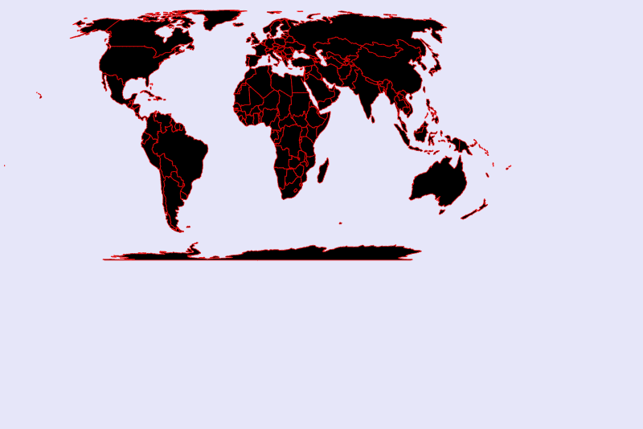

## From Line to Map


- Watch: [Intro Video](https://www.youtube.com/watch?v=kIID5FDi2JQ)

- intro inspiration:
  - [projections](https://www.jasondavies.com/)
  - [geo to circle (NOTE: old version of D3!!!!)](https://bl.ocks.org/mbostock/3081153)
  - [geo to circle: use case](https://twitter.com/karim_douieb/status/1181695687005745153)
- Line & map
  - check the Elements tab in the Developer tools:
    - [a line](http://cdv.leoneckert.com/geo/line)
    - [a map](http://cdv.leoneckert.com/geo/map)
  - -> both consists of path(s)
  - -> both draw their path(s) based on data
    - the line most likely draws out the actual data we want to visualize
    - the map is based on geojson data that describes the outlines of countries/provinces/cities we care about
      - this is new to our logic because it means we almost always work with 2 datasets! One for the map, and another for the actual data we want to present on that map
      - [GeoJSON](https://geojson.org/) is a **json file with a highly standardized format**. We don't have to (and shouldn't) attempt to write it ourselves, but find files for almost every geography we ever want to visualize online. Geometric Objects (e.g. the outline of a country) are referred to as "feature" in geojson. Groups of such objects (e.g. a group of outlines for each province of china) are called "FeatureCollection".
        - I usually start with a Google query if I need a specific geojson, e.g. "Germany provinces geojson file".
        - There is also various resources gathered on websites
          - [this might help](https://github.com/tmcw/awesome-geojson#data)
          - [or this](https://geojson-maps.ash.ms/)
          - [teczno.com/squares](http://teczno.com/squares/) (not for geojson, but to get a specific coordinate on the globe).
          - [http://geojsonlint.com/](http://geojsonlint.com/) lets you test geojson files.
          - ...please search the internet yourself, you will be successful
  - how does data turn into pixel values on our page:
    - with lines, we used D3 `.x()` and `.y()` methods to define how our data (e.g. some large value) should be translated onto the page (e.g. some much smaller pixel value)
    - with maps, the "data" are coordinates ([longitude](https://en.wikipedia.org/wiki/Longitude), [latitude](https://en.wikipedia.org/wiki/Latitude)). The translation from that range to pixels on our page has a special name: "projection"
      - projections are a HUGE subject
        - because it's [physically impossible to turn a 3D world into a 2D image](https://www.youtube.com/watch?v=kIID5FDi2JQ) without making compromises
        - projections are highly political
        - here is a [cool overview](https://storymaps.arcgis.com/stories/ea0519db9c184d7e84387924c84b703f) and some history
        - there are many different projections we can use, find them on [D3s GEO documentation](https://github.com/d3/d3-geo-projection)
    


#### Some notes:
Working with two datasetsets:
- this means that you will most likely* have a nested structure of data loading:
```js
d3.json("counries.geojson").then(function(geoData){
    d3.csv("otherdata.csv").then(function(incomingData){
      //...visualization code is likely* here
    })
})
```
\* I say "likely" a lot because every project is different. There is no perfect blueprint.

#### From Line to map:


A path necessitates a complicated string describing its curvature (see above). Previously we have used D3's `line()` method to help us make a function `lineMaker` which, after we specify the relevant features, helps us to produce the path `d` string. 

```js
let lineMaker = d3.line()
    .x(function(d, i){
      // this happens once for evey data point inside the array lineMaker deals with at a give time (once USA, once CHINA)
      return xScale(d.year);
    })
    .y(function(d, i){
      // same
      return yScale(d.birthsPerThousand);
    })
  ;
```


A map, too, is just a path, or multiple paths if the maps is composed of multiple shapes. The only difference is that the map paths are usually *closed* shapes. 

Before, our data described the way the line/path looks, with maps, the geojson file is the data that descibes our the map/path looks. 

We load the data the same way we load any other data. It consists of a feature collection with many features:


Each closed shape of the map (e.g. a country or a province) is a one feature. Geojson files usually also carry information about geo names, like country or province names (see "properties"):


Instead of our handy `lineMaker` function, with maps, we use `d3.geoPath()` which will help us turning our data (the geo data) into path elements: 

```js
// let lineMaker = d3.line()
//     .x(function(d){
//       return xScale(Number(d.year));
//     })
//     .y(function(d){
//       return yScale(Number(d.birthsPerThousand));
//     })
// ;

let pathMaker = d3.geoPath();
```

Next we almost use the same code we used when drawing lines (I leave the commented line code in to show you just HOW similar it is!) The curcial difference is that the data is `geoData.features` because that's the array within the geojson data (see above), and D3 always wants arrays:

```js
// CREATE SHAPES ON THE PAGE!
  // viz.selectAll(".line").data([incomingData]).enter()
  //   .append("path")
  //     .attr("class", "line")
  //     .attr("d", lineMaker)
  //     .attr("fill", "none")
  //     .attr("stroke", "black")
  //     .attr("stroke-width", 8)
  // ;
  viz.selectAll(".province").data(geoData.features).enter()
  .append("path")
    .attr("class", "province")
    .attr("d", pathMaker)
    .attr("fill", "black")
    .attr("stroke", "red")
;
```

we already see the map!


But it's very small, why? Right now we are using the default style for a map, whatever geodata we feed into our current code, the maps will always appear in the same spot. For example, if I us all countries in the world, instead of just china - making the change right here 

```js
// IMPORT DATA
// d3.json("mainland.geojson").then(function(geoData){
d3.json("countries.geojson").then(function(geoData){
    // ...
```

then the countries show up in the exact same spot, with China overlapping the same position as the previous China when using China data alone:


That's because in both cases we use the default **projection**. That means we use the same translation between the globe's longitudes and latirdues and how they are being *projected* onto our 2-dimensional screen. 

A **projection** is the same as the **scale** idea we have learned before, only for maps. We can deliberatedly use and modify the projection we are using (instead of using the default) in order to make the map appear in the way we want:

```js
let projection = d3.geoEqualEarth();
```

I am using this projection I found in [D3s GEO documentation](https://github.com/d3/d3-geo-projection).

An now we tell the pathMaker which projection it should use when construction the paths:

```js
let pathMaker = d3.geoPath(projection);
```



the map is now projected differently!

We can move the map to our SVG's center:


```js
let projection = d3.geoEqualEarth()
                    .translate([w/2, h/2])
;
```

We can say which coordinate should be in the center of our SVG. For example, Shanghai:


```js
let projection = d3.geoEqualEarth()
                    .translate([w/2, h/2])
                    .center([121.4737, 31.2304])
;
```

Another function fits whatever shapes we display into a box we defined (This will overwrite the previous positioning adjustments, so I comment them out).


```js
let projection = d3.geoEqualEarth()
                    // .translate([w/2, h/2])
                    // .center([121.4737, 31.2304])
                    .fitExtent([[padding, padding], [w-padding, h-padding]], geoData)
;
```

Let's assume we bring the China map back:


```js
let projection = d3.geoEqualEarth()
                    .translate([w/2, h/2])
                    .center([121.4737, 31.2304])
                    // .fitExtent([[padding, padding], [w-padding, h-padding]], geoData)
;
```
Like this, Shanghai is centered and we'd need to scale the map to make it larger. 


```js
let projection = d3.geoEqualEarth()
                    // .translate([w/2, h/2])
                    // .center([121.4737, 31.2304])
                    .fitExtent([[padding, padding], [w-padding, h-padding]], geoData)
;
```

Using `.fitExtent` instead, adjusts the size nicely. 


#### Visualize things on the map:

Your map is in place, how to address points on the map?
- D3's projections are used to bring the whole map to the page...
```js
let projection = d3.geoEqualEarth();
let pathMaker = d3.geoPath(projection);
```
- ...but can also be used much like familiar scales:
  - we can give a projection a set of longitude and latitude and it will return an array of pixel values that correspond to the location on svg map:
  ```js
  let longitude = 114.163;
  let latitude = 22.299;
  ```
  then the position of a rectangle could be defined like this:
  ```js
  datagroup.append("rect")
    .attr("cx", function(d, i){
        return projection([longitude, latitude])[0]
    })
    .attr("cy", function(d, i){
        return projection([longitude, latitude])[1]
    })
  ```
  - NOTE: This rectangle will NOT vary in size (radius) along with the projection.
    - for making circles actual part of the map, see [d3.geoCircle()](https://github.com/d3/d3-geo#spherical-shapes)


### Video
For a step by step video, and additional tricks (coloring specific provinces or countries), watch my [video lecture](https://drive.google.com/file/d/14NjhbUB2jH654_0dzXBoLMZhAStkEbMq/view).

### Exercise:

How could you make transitions on maps, or even transition the projection?

