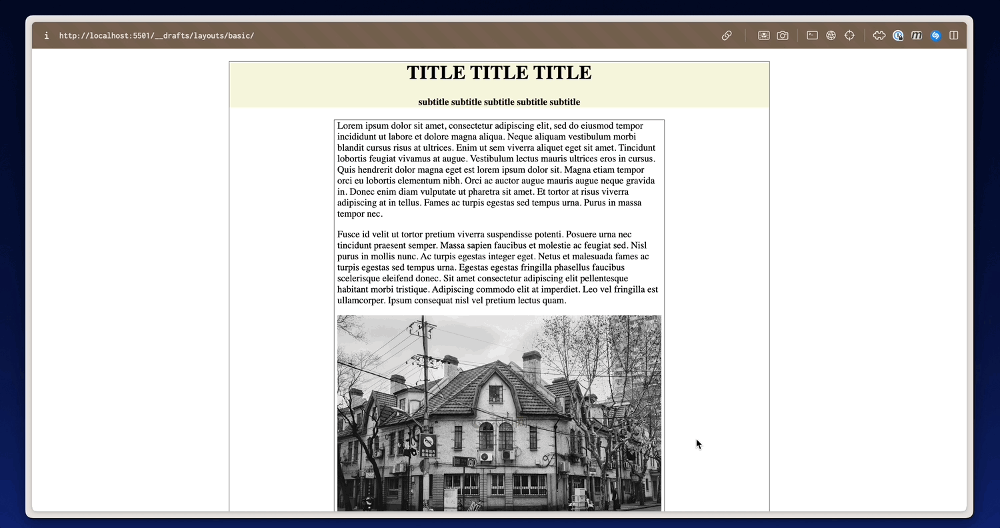
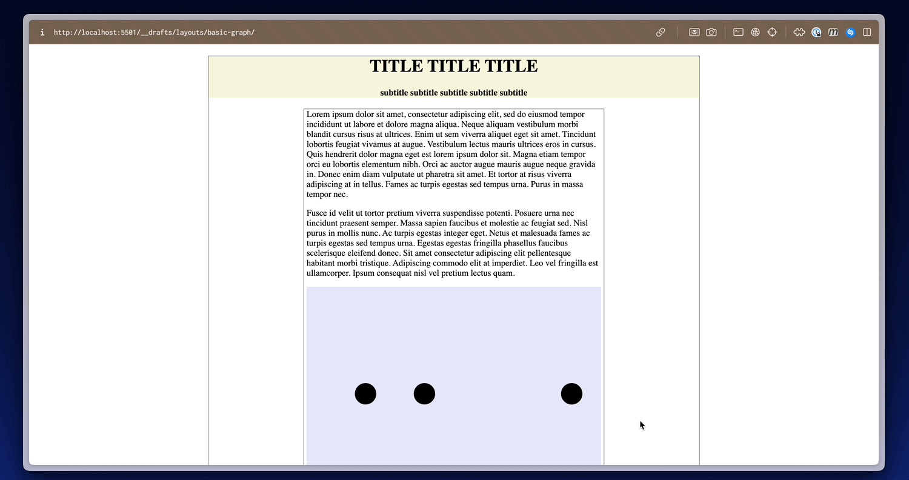
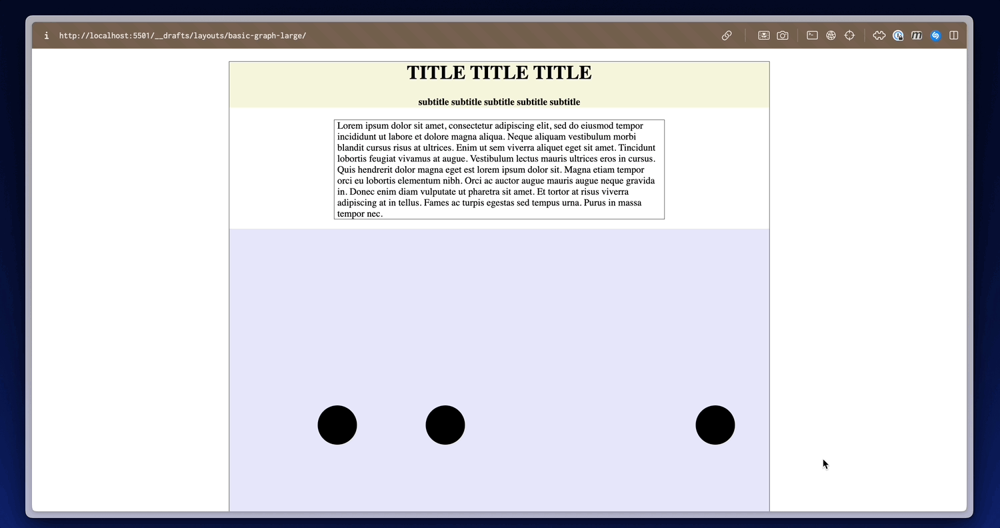

## Layouts

You can use the layouts in the folder as starting points and as components of your final project. **Important: make the design your own, how can the design make your project more engaging?**

* You can see the Code for the layouts online [here](https://github.com/leoneckert/sdv-s24/tree/main/layouts).
* Download all examples [here](https://github.com/leoneckert/sdv-s24/raw/main/layouts/sdv-layouts.zip)

#### Basic ([Live](https://leoneckert.github.io/sdv-s24/layouts/basic))
* centered
* responsive text
* image with caption

#### Basic Graph ([Live](https://leoneckert.github.io/sdv-s24/layouts/basic-graph))
* like above but with D3 graph (svg)

#### Basic Large Graph ([Live](https://leoneckert.github.io/sdv-s24/layouts/basic-graph-large))
* like above, but with larger graph

#### Sticky Graph ([Live](https://leoneckert.github.io/sdv-s24/layouts/sticky-graph))
* graph sticking in view while text scrolls by

#### Sticky Graph  ([Live](https://leoneckert.github.io/sdv-s24/layouts/sticky-graph-scroll-transition))
* like above, but each text triggers transitions in the graph

